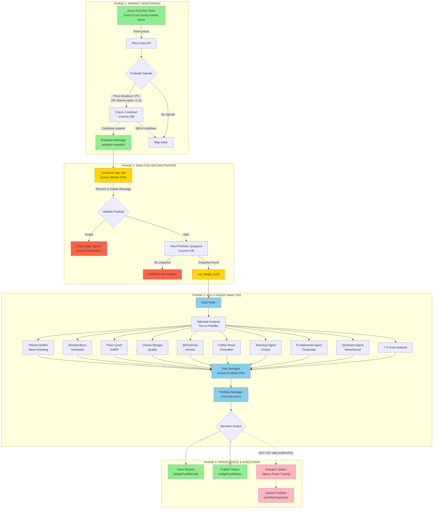

## Legend

- 🟢 **Green (Solid)**: Working components
- 🟡 **Yellow (Solid)**: Partially working, needs testing
- 🔵 **Blue (Solid)**: Configured but not fully tested
- 🌸 **Pink (Dashed)**: Planned but not implemented
- 🔴 **Red (Solid)**: Error conditions

## Current Status Summary

| Phase | Status | Details |
|-------|--------|---------|
| **1. Market Monitoring** | ✅ **WORKING** | Function app successfully monitors prices, detects signals, enqueues messages |
| **2. Queue Worker** | ⚠️ **PARTIALLY WORKING** | Polls queue, validates messages, fetches portfolio - **NOW FIXED** after encoding issue |
| **3. Multi-Agent Analysis** | 🔵 **CONFIGURED** | All 18 analysts ready, LangGraph workflow defined - **NEEDS TESTING** |
| **4. Trading Execution** | ❌ **NOT IMPLEMENTED** | Alpaca integration exists in CLI but not in queue worker |

## Critical Path to Full Functionality

1. ✅ **Fix queue message encoding** - COMPLETED
2. 🔄 **Seed initial portfolio** in Cosmos DB
3. 🔄 **Verify multi-agent analysis** runs successfully
4. 🔄 **Integrate Alpaca trading** into queue worker
