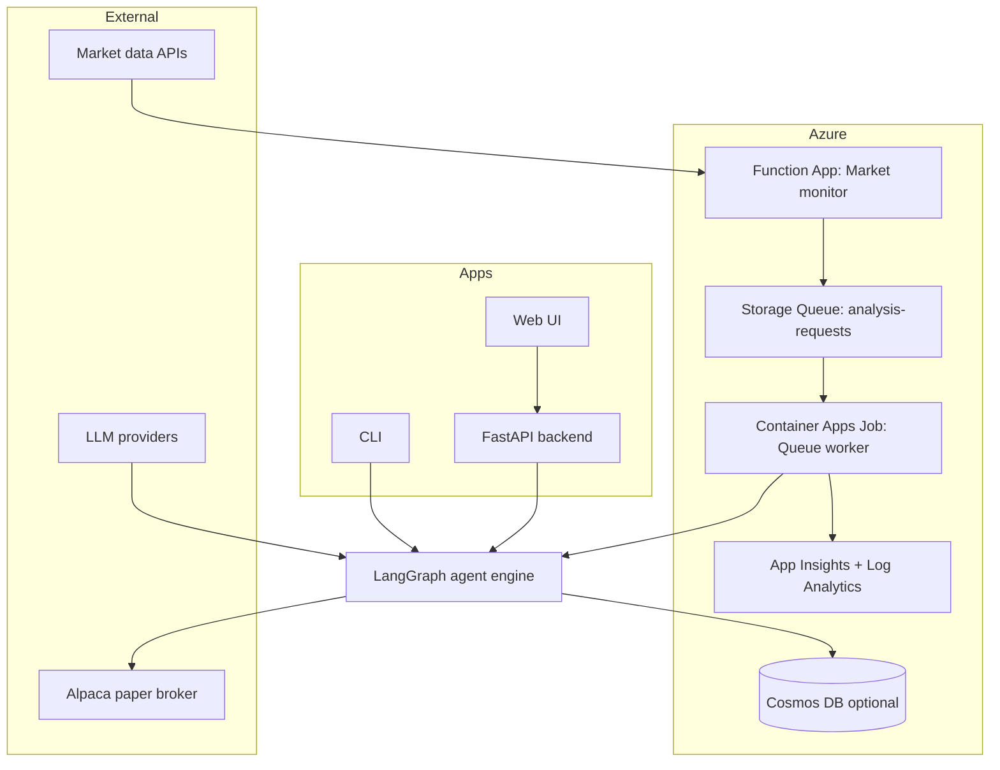
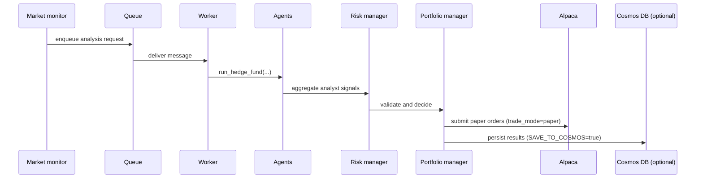

# Architecture

## System context


## Core components
| Component | Runtime | Key code |
| --- | --- | --- |
| Market monitor | Azure Functions timer | infra/monitoring/function_app.py |
| Queue worker | Container Apps Job | src/jobs/queue_worker.py |
| Agent engine | Python + LangGraph | src/main.py |
| Broker execution | Alpaca paper API | src/brokers/ |
| Persistence | Cosmos repository | src/data/cosmos_repository.py |
| Web API | FastAPI | app/backend/main.py |
| Web UI | React/Vite | app/frontend |
| Infrastructure | Bicep + scripts | infra/bicep/main.bicep, infra/scripts/ |

## Analysis cycle


## Queue message schema (summary)
| Field | Type | Required | Notes |
| --- | --- | --- | --- |
| tickers | array of strings | yes | Single ticker also accepted as `ticker` |
| analysis_window | object | yes | `start` and `end` dates, or `lookback_days` |
| overrides | object | no | trade_mode, dry_run, confidence_threshold, model_name, model_provider, selected_analysts, show_reasoning |

Example:
```json
{
  "tickers": ["AAPL"],
  "analysis_window": {"start": "2025-01-01", "end": "2025-03-01"},
  "overrides": {"trade_mode": "paper", "confidence_threshold": 70}
}
```

## Trade modes
- analysis: generate recommendations only (no broker calls).
- paper: execute paper orders via Alpaca.
- paper + dry_run: simulate order generation with no API calls.

## Data persistence (Cosmos DB)
If `SAVE_TO_COSMOS=true`, the worker writes to these containers:
- portfolios
- analyst-signals
- decisions
- portfolioSnapshots
- hedgeFundResults
- hedgeFundStatus
- broker-orders
- monitor-cooldowns

## Observability
- Application Insights and Log Analytics capture logs and metrics for Functions and Container Apps.
- LangSmith tracing is optional for LLM call inspection.
