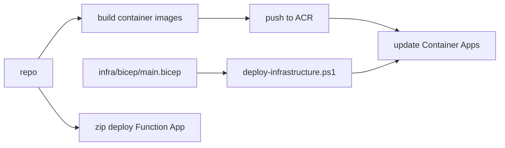

# Operations

## Deployment modes
### Local
- CLI: `src/main.py` (interactive analyst selection).
- Web app: FastAPI backend in `app/backend` with a React/Vite frontend in `app/frontend`.

### Azure production
- Function App for market monitoring.
- Storage Queue for analysis requests.
- Container Apps Job for queue processing.
- Optional Cosmos DB for persistence.
- Application Insights + Log Analytics for telemetry.

## Deployment workflow

## Infrastructure resources (Azure)
| Layer | Resource | Purpose |
| --- | --- | --- |
| Container Registry | Azure Container Registry | Store API and worker images |
| Compute | Container Apps environment + Job | Run API and queue worker |
| State | Cosmos DB (serverless) | Optional persistence and cooldowns |
| Messaging | Storage account + queues | analysis-requests and dead-letter |
| Serverless | Function App | Market monitor timer |
| Monitoring | Application Insights + Log Analytics | Logs and metrics |

## Configuration quick reference
### Required for most runs
- At least one LLM API key: OPENAI_API_KEY, ANTHROPIC_API_KEY, GROQ_API_KEY, DEEPSEEK_API_KEY, GOOGLE_API_KEY, XAI_API_KEY, GIGACHAT_API_KEY, or OPENROUTER_API_KEY.
- FINANCIAL_DATASETS_API_KEY for extended ticker coverage.
- Alpaca paper trading: APCA_API_KEY_ID and APCA_API_SECRET_KEY.

### Queue worker
- QUEUE_ACCOUNT, QUEUE_NAME, QUEUE_SAS
- QUEUE_DEAD_LETTER_NAME (optional)
- USE_ALPACA_PORTFOLIO (default true)
- SAVE_TO_COSMOS (default false)
- MODEL_PROVIDER, MODEL_NAME (optional)

### Market monitor (Function App)
- MARKET_MONITOR_QUEUE_CONNECTION_STRING and MARKET_MONITOR_QUEUE_NAME
- MARKET_MONITOR_WATCHLIST
- MARKET_MONITOR_PERCENT_CHANGE_THRESHOLD, MARKET_MONITOR_VOLUME_SPIKE_MULTIPLIER
- MARKET_MONITOR_COOLDOWN_SECONDS, MARKET_MONITOR_ANALYSIS_WINDOW_MINUTES

### Cosmos DB (optional)
- COSMOS_ENDPOINT, COSMOS_KEY, COSMOS_DATABASE

### Observability
- LANGCHAIN_TRACING_V2, LANGCHAIN_API_KEY, LANGCHAIN_PROJECT

### Corporate SSL (optional)
- CORP_CA_BUNDLE to extend trusted certificates in corporate environments.

## Runbook checklist
- Confirm the Function App timer is triggering during market hours.
- Check Storage Queue depth and dead-letter queue volume.
- Review Container Apps Job runs for errors and duration.
- Verify Alpaca paper orders and account state.
- Validate Cosmos DB writes when SAVE_TO_COSMOS is enabled.

## Change control and AI workflow
- OpenSpec governs new capabilities and architectural changes (`openspec/`).
- Use `openspec/project.md` for conventions and `openspec/specs/` for current behavior.
- AI assistant guidance lives in `AGENTS.md`, `CLAUDE.md`, and `GEMINI.md`.

## Future structure considerations
- `infra/` is already a clean boundary if you later split infrastructure into a separate repo.
