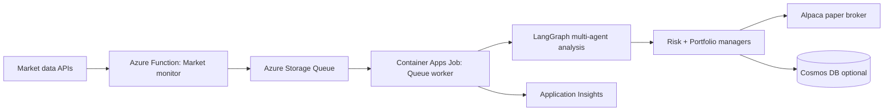

# AI Hedge Fund - Overview

## Purpose
AI Hedge Fund is a multi-agent, event-driven trading system. It watches markets, runs AI analysis, and can execute paper trades via Alpaca. The production deployment runs on Azure and scales to zero when idle.

## Who this is for
- Business stakeholders who want a clear explanation of the problem and value.
- Technical stakeholders who need the system flow before the deep dive.

## Pain points and how we address them
| Pain point | Approach |
| --- | --- |
| Market signals are noisy and hard to trust | Combine 18 analyst agents plus risk and portfolio managers to triangulate decisions |
| Continuous monitoring is costly | Serverless timer plus queue plus scale-to-zero workers |
| Execution must be repeatable and auditable | Structured queue payloads, optional Cosmos DB persistence, and centralized logs |
| LLM cost and latency vary | Configurable models, optional tracing, and targeted analysis windows |

## System at a glance

## Production footprint (Azure)
- Function App for market monitoring (`infra/monitoring/function_app.py`)
- Storage Queue for analysis requests
- Container Apps Job for the queue worker (`src/jobs/queue_worker.py`)
- Optional Cosmos DB for results and cooldowns
- Application Insights and Log Analytics for telemetry

## Key capabilities
- Multi-agent decision engine with configurable analysts
- Event-driven orchestration that scales to zero
- Paper trading with Alpaca and optional persistence
- CLI and web app interfaces
- Observability via App Insights and LangSmith (optional)

## Where to go next
- Architecture details: docs/architecture.md
- Deployment and runbook: docs/operations.md

## Disclaimer
This project is for educational and research purposes only.
